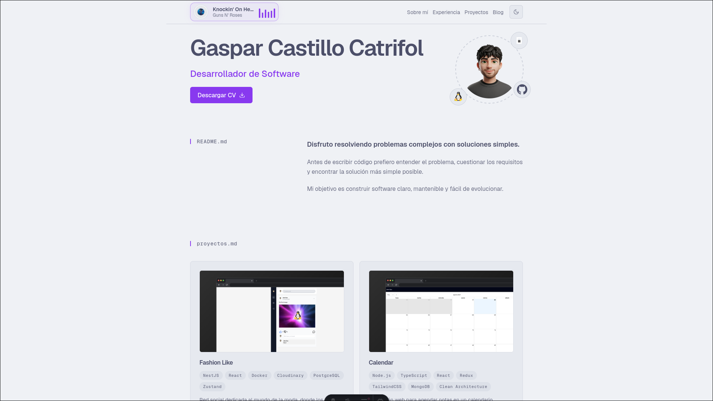
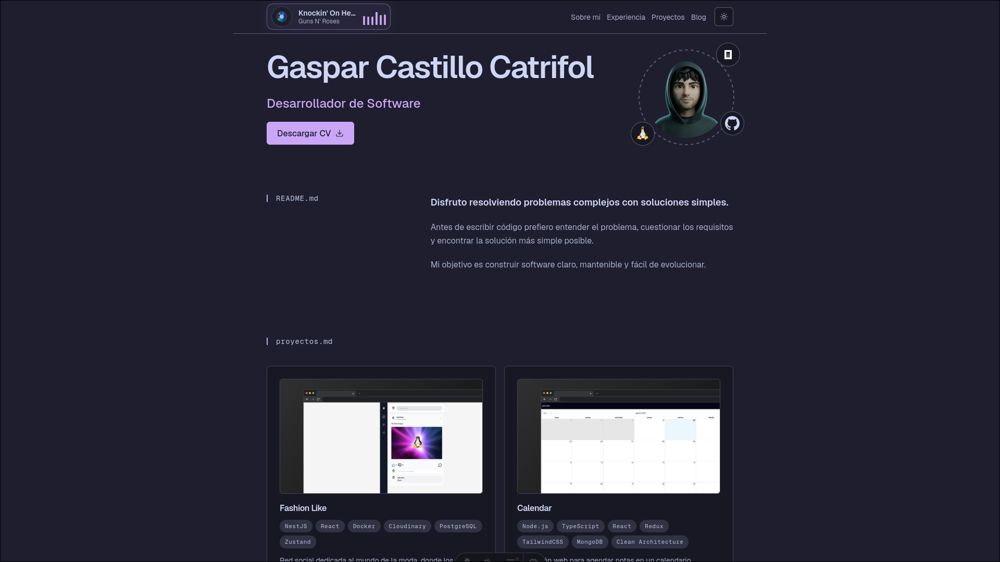

<div align="center">
  <h1>Portfolio — Gaspar Castillo</h1>
</div>

<p align="center">
  Personal portfolio and blog built by <a href="https://github.com/isakiDev">Gaspar Castillo</a>, a software developer focused on building clear, well-thought-out, maintainable products.
  <br />
  <a href="https://isakidev.vercel.app"><strong>Visit the live site →</strong></a>
</p>

<p align="center">
  
  
  
  
</p>

<div align="center">
  <table>
    <tr>
      <td>
        <a href="https://isakidev.vercel.app">
          
        </a>
      </td>
      <td>
        <a href="https://isakidev.vercel.app">
          
        </a>
      </td>
    </tr>
    <tr>
      <td align="center"><strong>Light mode</strong></td>
      <td align="center"><strong>Dark mode</strong></td>
    </tr>
  </table>
</div>

## Features

- **Landing page** — hero, about, projects and experience sections
- **Activity log** — a `github.log` section that lists your latest commits from GitHub
- **Now Playing** — shows what you're currently listening to on Spotify
- **Blog** — Markdown posts with tags, reading time and pagination
- **Dark / light theme** with a toggle, Geist font, Tailwind styling

## Tech stack

- [Astro](https://astro.build) 7 with the Node.js (standalone) adapter
- [Tailwind CSS](https://tailwindcss.com) 4 via the Vite plugin
- [TypeScript](https://www.typescriptlang.org) and [astro-expressive-code](https://expressive-code.com)
- [Geist](https://vercel.com/font) variable fonts

## Getting started

```bash
pnpm install
pnpm dev
```

Set the environment variables in `.env` (see `.env.example`):

```bash
GITHUB_TOKEN=          # to fetch recent commits
SPOTIFY_CLIENT_ID=     # to show your current song
SPOTIFY_CLIENT_SECRET=
SPOTIFY_REFRESH_TOKEN=
```

## Project structure

```
src/
├── features/
│   ├── blog/               # blog section, post list, pagination
│   └── portfolio/          # portfolio sections, services, data, types
├── layouts/                # Layout.astro (HTML shell, theme & metadata)
├── components/             # shared components (Header, Footer, icons)
├── pages/                  # routes (/, /blog, ..., 404)
├── content/                # Markdown blog posts
├── styles/                 # global styles
└── content.config.ts       # content collection schema
```

The portfolio is organized into features, each with its own sections, components and services. Content lives in `src/content/blog` as Markdown; projects and experience are defined as typed data in `src/features/portfolio/data`.